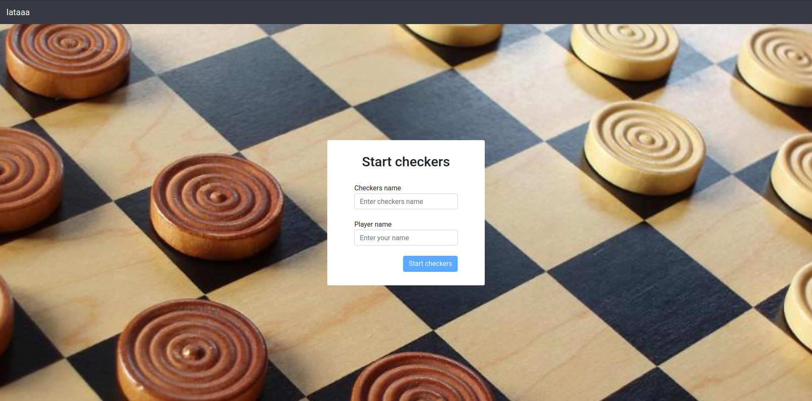
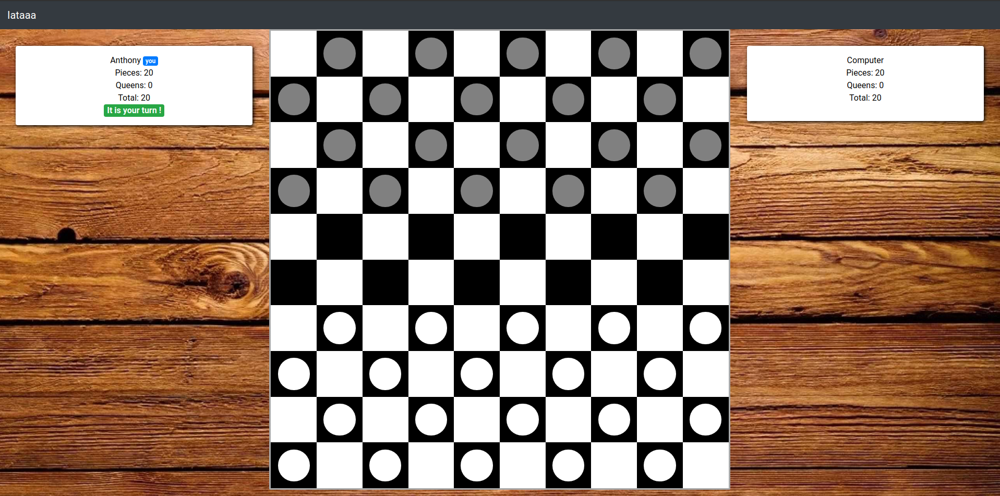

# IAtaaa

IAtaaa Server is web platform to manage artificial intelligence game. The name IAtaaa stands for the IA (Intelligence Artificielle in french) acronym and the Yatta japanese word for "We did it".
For now only game is implemented:
* **Checkers**: It's to possible to game against computer but AI is not yet implemented. Computer play random move.

## Architecture
You can find 2 directories in this repository:
* **api**: It contains all api (**contains README**)
* **ui**: It contains project of IAtaaa user interface (**contains README**)

## Technologies
List of technologies used in this project:
* Java 9
* Spring Boot 2
* Maven
* Docker
* Docker Compose
* React
* Redux

## Getting Started
### Requirements
It is necessary for run IAtaaa in your computer.
* Docker
* Docker Compose

### Run project on your computer
```sh
docker-compose up -d
```
Navigate to [http://172.16.0.30:3000](http://172.16.0.30:3000)

**Warning**: It's no configured to run in production.

## Screens



## Contributor
* Anthony GODIN <gdn.anthony@gmail.com>
